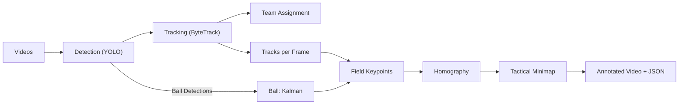
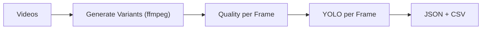

# Project Pipeline (Simple Summary)

This document explains, in a simple way, how the project works and how the main pipeline is organized. It also summarizes the most important files.

## Quick Overview

There are two main parts:

1. **Complete Analysis Pipeline (Football)**: player/ball detection, tracking, field keypoints, homography and tactical analysis, with annotated video and JSON results.
2. **Video Quality Analyzer**: evaluates video quality (sharpness, SNR, blur) and performs YOLO detection per frame to compare variants.

## Complete Analysis Pipeline (Football)

Simplified flow (in two video passes):

1. **Initialization**
   - Loads detection and keypoint models.
   - Prepares tracking (ByteTrack) and team clustering.

2. **Pass 1: Detection + Tracking**
   - Detection of players/ball/referees per frame.
   - Player tracking with ByteTrack.
   - Team assignment (clustering by embeddings or colors).
   - Saves track history per frame.

3. **Processing**
   - Smooths ball trajectory (Kalman).
   - Interpolates gaps and smooths boxes (bboxes).

4. **Pass 2: Annotations + Tactics**
   - Generates annotated video (bboxes, IDs, teams).
   - Detects field keypoints.
   - Calculates homography to transform to field coordinates.
   - Creates tactical minimap (optional) and overlays on video.

5. **Outputs**
   - Final annotated video.
   - JSON with tracks, statistics and metrics per frame.

## Video Quality Analyzer (Separate Pipeline)

1. Reads videos from input folder.
2. Generates variants (1080p, 720p, 480p) with ffmpeg.
3. Evaluates quality per frame (sharpness, SNR, blur).
4. Performs YOLO detection on sampled frames.
5. Generates JSON per video and summary CSV.

## File Mapping (File-by-File)

### Main Entries

- `main.py`: entrypoint of the complete pipeline. Creates and executes `CompleteSoccerAnalysisPipeline`.
- `run_analyzer.py`: entrypoint of the Video Quality Analyzer.
- `analyzer_config.json`: Video Quality Analyzer configuration.
- `constants.py`: global paths and parameters (models, thresholds, sizes, flags).

### Pipelines

- `pipelines/detection_pipeline.py`: initializes YOLO and executes detection per frame.
- `pipelines/tracking_pipeline.py`: ByteTrack + team assignment + track export.
- `pipelines/keypoint_pipeline.py`: detects field keypoints and extracts metadata.
- `pipelines/tactical_pipeline.py`: homography and tactical minimap.
- `pipelines/processing_pipeline.py`: I/O, interpolation, and output path generation.

### Detection and Tracking

- `player_detection/detect_players.py`: core detection functions (players/ball/referees).
- `player_tracking/tracking.py`: ByteTrack wrapper.
- `player_annotations/annotators.py`: drawing bboxes, IDs, teams and overlays.

### Keypoints and Homography

- `keypoint_detection/detect_keypoints.py`: field keypoint detection.
- `keypoint_detection/keypoint_constants.py`: keypoint names and field parameters.
- `tactical_analysis/homography.py`: transforms detections to field coordinates.

### Utilities

- `utils/ball_tracker.py`: Kalman filter to smooth the ball.
- `utils/vid_utils.py`: video read/write helpers.

### Data and Output Folders

- `videos/`: input videos (complete pipeline).
- `inputvideo/`: input examples and JSONs.
- `output/`: outputs from the complete pipeline.
- `analysis_output/` and `variants/`: outputs from the Video Quality Analyzer.

## How to Run (Quick Summary)

- Complete pipeline: execute `main.py` (uses configurations in `constants.py`).
- Video Quality Analyzer: execute `run_analyzer.py` (uses `analyzer_config.json`).

## Flow Diagram (README-friendly)

Complete Pipeline (Football) — Mermaid diagram (recommended for GitHub README)



Fallback (plain text) — for viewers without Mermaid support

```
[Videos] -> [Detection (YOLO)] -> [Tracking (ByteTrack)] -> [Team Assignment]
          |                          |
          v                          v
       [Ball: Kalman]            [Tracks per frame]
          |                          |
          +-----------+--------------+
                 v
          [Field Keypoints]
                 |
                 v
              [Homography]
                 |
                 v
            [Tactical Minimap]
                 |
                 v
         [Annotated Video + JSON]
```

Video Quality Analyzer — Mermaid diagram (recommended)



Fallback (plain text)

```
[Videos] -> [Generate Variants] -> [Quality per Frame] -> [YOLO per Frame]
                 |                        |
                 +-----------+------------+
                   v
                [JSON + CSV]
```


